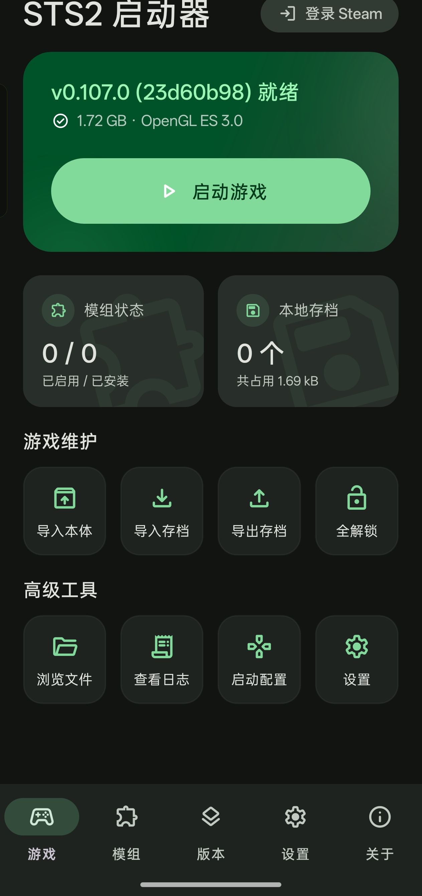
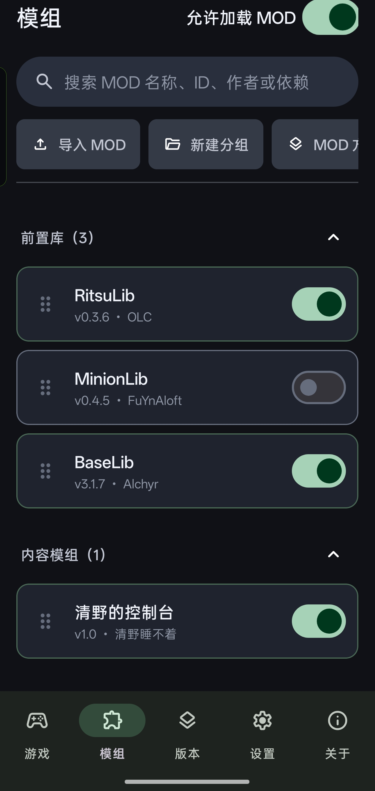
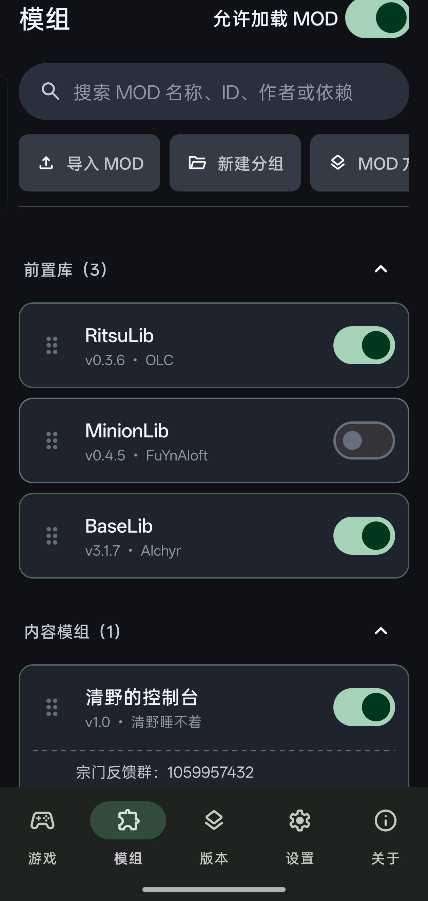
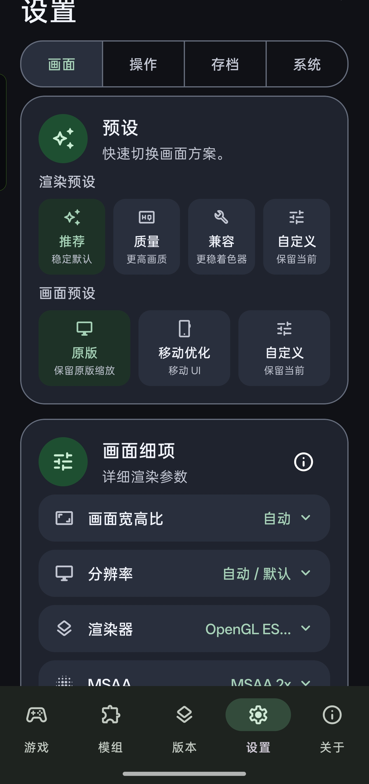

<div align="right">
  <strong><a href="README_CN.md">🇨🇳 简体中文 (Chinese)</a></strong>
</div>

<p align="center">
  <!-- Replace with your actual app icon path or image URL -->
  
</p>

<h1 align="center">Slay the Spire 2 Android Launcher</h1>

<p align="center">
  An unofficial, open-source mobile compatibility layer and launcher environment for <i>Slay the Spire 2</i>, based on the Godot/Mono runtime.
</p>

<p align="center">
  <a href="https://github.com/ModinMobileSTS/Sts2MobileLauncher/blob/main/LICENSE">
    
  </a>
  
  
</p>

## Screenshots

<p align="center">
  <!-- Please replace the src with actual screenshot paths -->
  
  
  
  
</p>

## About the Project

This project is an experimental, unofficial Android port and launcher framework for *Slay the Spire 2*. It **DOES NOT** contain any base game files. Instead, it provides an Android shell that allows players to import and run their legally owned PC game files on mobile devices, featuring support for Mod loading, Steam Workshop browsing/direct ID or URL opening/download tracking with anonymous public browsing and WorkshopOnAndroid-compatible access fallback, local save snapshots, Steam Cloud and WebDAV save synchronization, and launcher update checks from the About page. When an update is found, the launcher can open either the GitHub release page or the Bilibili dynamic feed.

**The core architecture consists of three layers:**
1. **Android Launcher Shell (`android/`):** Handles game data importing, Steam login and game downloading, Steam Workshop public browsing, direct ID/URL opening, and download tracking with default compatible-access routing for networks where Steam Community/API or SteamPipe CDN direct connections time out, local save snapshots, Steam Cloud/WebDAV save syncing, and local file/MOD management. Once everything is ready, it boots up the Godot game process.
2. **Android Compatibility Pack (`port-mod/` submodule):** Acts as a low-level hook (based on Harmony), loaded at the very beginning of the game boot process. It intercepts and fixes various PC-to-Android incompatibilities (e.g., input adaptation, path redirection, PC-specific shader replacement, Mod loader bridging).
3. **Base Game (Provided by User):** Supplied by the user either by importing the PC version's `SlayTheSpire2.zip` or by legally downloading it via the SteamPipe API after logging into their Steam account within the app.

Custom player counts above four remain experimental. The full compatibility pack now dynamically creates treasure relic holders and rest-site character slots, including safe fifth-player focus and distinct treasure award/fight hand placement; this fixes the five-player chest flow that previously stopped after rock-paper-scissors. Other vanilla screens may still contain four-player assumptions, so the configurable capacity is not a guarantee that every player count is supported end to end.

---

## Legal Disclaimer

- **Unofficial Project:** This is an open-source technical research project created by the player community. It is not affiliated with Mega Crit, *Slay the Spire 2*, or the Godot Engine, nor does it represent their views.
- **No Game Assets Provided:** This repository **ABSOLUTELY DOES NOT** contain or distribute any copyrighted commercial game assets (including but not limited to audio, images, PCK files, core logic DLLs, etc.).
- **Legal Use:** Please comply with relevant software licenses, platform rules, and local laws. You must **legally own** a PC copy of *Slay the Spire 2* to use this tool to run the game on your own device.
- **No Pirated APK Distribution:** Do not use standalone APKs bundled with commercial game assets for public release or commercial monetization.

---

## Credits & References

The creation of this project relies heavily on the explorations of the open-source community. Special thanks to the following projects for their inspiration and code references:

- **[StS2-Launcher_Mod_Manager](https://github.com/iunius612/StS2-Launcher_Mod_Manager)**
  Provided underlying concepts for stripping the Godot/Mono runtime, Android compatibility patch load orders, and design references for some build scripts.
- **[SlayTheAmethystModded](https://github.com/ModinMobileSTS/SlayTheAmethystModded)**
  An unofficial mobile launcher for STS1. The reverse-engineered integration and source code for `steam-protocol`, `steam-content` (SteamPipe game downloads), and Steam Cloud saves in this project are primarily ported/adapted from it.
- **[WorkshopAndroidDownloader](https://github.com/Apricityx/WorkshopAndroidDownloader)**
  Android Steam Workshop downloader reference used for the launcher Workshop browsing, download, and update-tracking flow.
- **[STS2-RitsuLib](https://github.com/BAKAOLC/STS2-RitsuLib) / [BaseLib-StS2](https://github.com/Alchyr/BaseLib-StS2)**
  Served as vital test baseline reference libraries for troubleshooting Android MOD compatibility.
- **[Google Material Symbols](https://fonts.google.com/icons)**
  Provides the official rounded icon outlines used by the launcher UI, generated into Android vector drawables from the bundled font.
- **[Android desugar_jdk_libs](https://github.com/google/desugar_jdk_libs)**
  Provides Java 8+ library API compatibility (including `java.time`) for Android 7.x devices.

*(For detailed third-party open-source licenses, including test-only Kotlin Test/JUnit and OkHttp MockWebServer dependencies that are not packaged into the APK, please see [THIRD_PARTY_LICENSES.md](THIRD_PARTY_LICENSES.md))*

---

## Core Security Notes

For the safety of your device and accounts, please pay strict attention to the following when using and compiling this app:

1. **ADB & `Debuggable` Risks:**
   The current default release build configuration **keeps `debuggable=true`** (to facilitate log capture in case of crashes). This means any computer or malicious software connected to your phone with `ADB` permissions can extract data from this app (including encrypted Steam credentials). **NEVER grant ADB debugging permissions to untrusted computers or third-party app stores.**
2. **Steam Account Security:**
   - This app will **NEVER** upload your Steam account password to any third-party server. The password and the Steam Guard code entered for the current login remain in memory only; they are not written to disk, an Android service intent, or logs.
   - After Steam accepts the initial credential request, the launcher temporarily stores only an encrypted, short-lived authentication transaction handle so an interrupted login can resume. The handle expires automatically and contains Steam routing/status data, not the password or one-time Guard code.
   - The `Refresh Token` is encrypted and stored locally via Android's `EncryptedSharedPreferences`.
   - For Steam mobile confirmation, polling starts immediately. You can switch to the Steam app, approve the request, and return normally; keeping this launcher in a floating window or split screen is not required. A foreground authentication service keeps the transaction alive and reconnects to Steam CM when possible, while cancel or expiry removes the pending transaction.
   - **Strongly Recommended:** Only log into Steam using an APK compiled by yourself from trusted source code or obtained from a highly trusted channel.
3. **Malicious MOD Risks:**
   Mods for *Slay the Spire 2* are essentially arbitrarily executed C# code. **Malicious Mods can bypass the sandbox to directly read local files on your phone (including configurations containing your Steam Token).** Before attempting to install unknown Mods from untrusted sources, **make sure to log out of Steam in the app settings** to prevent account theft.

---

## How to Build (APK Packaging)

> **Note:** For complete environment configuration and parameter details, please refer to [`doc/build/building-and-packaging.md`](doc/build/building-and-packaging.md).

### 1. Prerequisites
- **OS:** Linux / macOS / WSL (Windows)
- **Toolchain:** 
  - JDK 17+
  - Android SDK (API 35) & NDK
  - .NET SDK (for compiling C# compat plugins)
  - Python 3

### 2. Get the Source Code
Because it includes the compatibility pack submodule, please clone with the `--recursive` flag:
```bash
git clone --recursive https://github.com/ModinMobileSTS/Sts2MobileLauncher.git
cd Sts2MobileLauncher
```

### 3. Local Environment Setup
Copy the environment variable templates and modify the `.env` and `local.properties` files according to your actual local paths:
```bash
cp .env.example .env
cp local.properties.example local.properties
```
> **Note:** The `.env` file must configure `JAVA_HOME`, `ANDROID_HOME`, `DOTNET_BIN`, and the original PC DLL reference paths used for compiling the compatibility pack (`STS2_ORIGINAL_*_REFERENCE_DIR`).

### 4. Sync Runtimes and Dependencies
Run the following script to extract large runtime artifacts (Godot templates, FMOD, etc.) to their designated locations (these files are git-ignored and must be generated locally):
```bash
tools/android/sync-runtime-from-references.sh
```

### 5. Compile Compatibility Packs (Compat Packs)
Compile and stage all bundled compatibility artifacts into APK assets:
```bash
tools/android/stage-bundled-compat-artifacts.sh
```
This stages the flattened schema-2 full compatibility family pack from `port-mod/` and the generic `offline-bootstrap/` fallback pack. The current `v0.110.x` public-beta line has its own stable target id because its managed API and multiplayer protocol differ from v0.109.x; v0.110.0 and v0.110.1 share that target because their compat source IL is equivalent. The older shared v0.109.x variant keeps the stable `v0.109.0` target id while matching both v0.109.0 and v0.109.1 by their exact original DLL SHA-256 values. A target may declare `sts2_dll_sha256` as either a legacy string or a list of API-compatible hashes. The offline bootstrap is only auto-matched when an imported game payload has no installed exact SHA/version compatibility pack. Its wildcard is a best-effort fallback rather than a compatibility guarantee: probe contract v2 resolves only understood runtime API shapes, marks success after real ModelDb initialization, and prevents a known-failed pack/version/payload-SHA tuple from being auto-selected again. Run `offline-bootstrap/tools/test-offline-contract.sh` to validate synthetic API changes and every locally configured original reference.

If the current launch profile has no usable compatibility pack, launching now opens a recommendation bottom sheet instead of only showing an error. It first recommends the best matching bundled or installed full target; only when no full target matches does it offer the generic offline fallback. The profile is changed only after the user chooses **Use recommendation and continue**, and the sheet can instead open compatibility pack management directly.

If you only need to rebuild the full `port-mod` family pack, use:
```bash
tools/android/stage-bundled-compat-packs.sh
```
Legacy per-version branch packs remain available for diagnostics:
```bash
COMPAT_PACK_BUILD_MODE=legacy tools/android/stage-bundled-compat-packs.sh
```

When bringing up a new game version, run the source-level port compatibility audit before editing targets or patches:
```bash
tools/port_mod_ast_audit.py \
  --old-source ../s2_original/s201091 \
  --new-source ../s2_original/s201100 \
  --port-mod port-mod/STS2AndroidPortCompat \
  --out .agent/reports/v110-port-mod-ast-audit
```
See [`doc/build/building-and-packaging.md`](doc/build/building-and-packaging.md) for report details and status meanings.

### 6. Build the Importer APK
Run the build script. This will output an "Importer APK" that **DOES NOT** contain the base game (the recommended, legally compliant distribution method):
```bash
tools/package/build_importer_apk.sh
```
Upon successful build, the APK will be output to `dist/sts2-re-importer.apk`.

Android high-refresh support is part of the normal APK: the app declares the
Android game category so OEM game/GPU scheduling can recognize `GodotApp`, then
requests the highest compatible refresh rate only while the game is resumed,
focused, and backed by a valid render `Surface`. Requests are coalesced per
Activity lifecycle and cancelled when the game pauses or its `Surface` is
destroyed. For each valid Surface epoch, Android 12+ issues one
`Surface.setFrameRate(..., CHANGE_FRAME_RATE_ALWAYS)` vote together with the
matching exact `Window` display mode when Android exposes one; devices that
only expose an alternative refresh rate use a refresh-rate-only Window request
with the exact mode ID cleared. A bounded delayed verification follows, and the
path does not use `SurfaceControl`. This behavior can be
disabled from Extra Settings → System below Preload. A disabled-by-default
performance overlay can also be enabled from Extra Settings → System.

The fullscreen render-resolution preset is applied by the full compatibility
pack at game startup and can also be switched immediately from the in-game
Android settings page. The root Window keeps Godot `CanvasItems` scaling while
only its renderer-side target changes, so cards, controls, touch coordinates,
and other content retain the same relative layout. The effective target follows
the current CanvasItems aspect (for example, a 1280×720 preset becomes 1600×720
on a 2400×1080 attachment). Android Surface size and the high-refresh request are
left untouched; aspect-ratio, UI-scale, global-scale, and font-scale settings
continue to apply independently.

### 7. ADB Automation Debugging
For connected-device debugging, the repository includes an ADB harness that can install the APK, push a payload/compat pack/MOD into app-private storage, run launch preparation, start the game, and collect logs or Perfetto traces:
```bash
tools/debug/sts2-adb-debug.sh build-install
tools/debug/sts2-adb-debug.sh status --pull
tools/debug/sts2-adb-debug.sh launch --mode perf --preload aggressive --logcat-duration 45 --perfetto 45 --pull
```
See [`doc/build/adb-automation-debugging.md`](doc/build/adb-automation-debugging.md) for targeted MOD/compat/preload scenarios.

---

## More Documentation

If you want to contribute to development, understand how the compatibility packs work, or dive deeper into the architecture, please check the `doc/` directory:

- [Project Structure & Version Model](doc/architecture/project-structure.md)
- [Detailed Guide to Building & Packaging](doc/build/building-and-packaging.md)
- [ADB Automation Debugging](doc/build/adb-automation-debugging.md)
- [Runtime Loading & Compat Pack Lifecycle](doc/runtime/compat-pack-loading-flow.md)
- [Notes on Developing MOD Compatibility Patches](doc/modding/mod-and-compat-notes.md)
